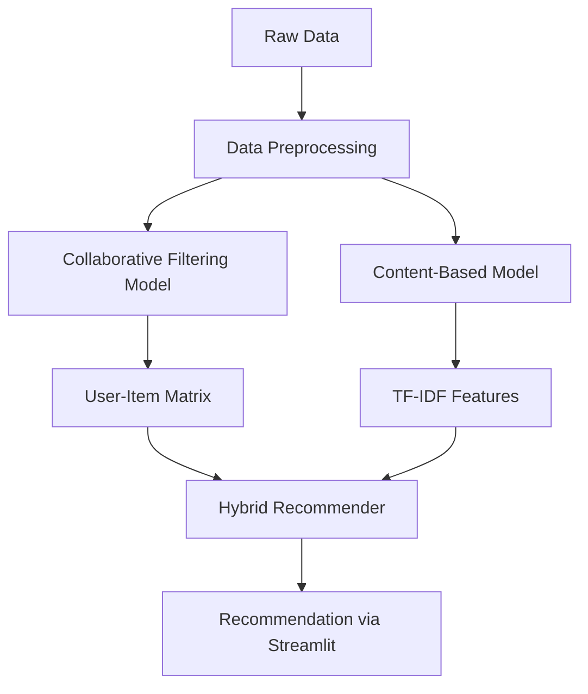

# 🔥 **BookSage AI**

**Multi-Method Book Recommendation System** Provide personalized book recommendations by combining **Collaborative Filtering** and **Content-Based Filtering** techniques, ensuring high accuracy even when user interaction data is sparse.

[](https://github.com/user-attachments/assets/ab5d829d-76b1-4207-bb08-442a0eacb684)

---

## 🎯 **Project Goal**
In today’s digital era, readers are overwhelmed with millions of book options across various platforms, making it difficult to find books aligned with their interests, preferences, or past reading history. Traditional search-based discovery methods fall short in providing personalized and engaging reading suggestions.

To address this challenge, the goal is to design and implement a **personalized hybrid book recommendation system** that leverages both **collaborative filtering** (based on user behavior and ratings) and **content-based filtering** (based on book metadata like author, publisher, and year). The system should support:

* Image-based output (for UI-friendly recommendations),
* A fallback mechanism for cold-start scenarios,
* Adjustable weights for hybrid scoring,
* Scalable performance for large datasets.

---

## 🌐 **Live Demo**

🔗 **Try the Hybrid Book Recommendation System live:**
👉 [https://booksage-ai.onrender.com/](https://booksage-ai.onrender.com/)

---

## 🧠 **Core Technologies**

| **Category**               | **Technology/Resource**                                                                 |
|----------------------------|----------------------------------------------------------------------------------------|
| **Core Framework**         | Python 3.9+, Pandas, NumPy                                                            |
| **Data Processing**        | Pandas (Data Cleaning), scikit-learn (Feature Engineering)                            |
| **Recommendation Models**  | Hybrid System: Collaborative Filtering + Content-Based Filtering                      |
| **Collaborative Filtering**| Scipy (csr_matrix), sklearn.neighbors (NearestNeighbors)                              |
| **Content-Based Filtering**| sklearn (TfidfVectorizer, cosine_similarity)                                          |
| **Data Sources**           | Book-Crossing Dataset (BX-Books, BX-Users, BX-Ratings)                               |
| **Feature Engineering**    | TF-IDF (Title+Author+Publisher+Year combined features)                                |
| **Model Persistence**      | Pickle (Model Serialization)                                                          |
| **Evaluation Metrics**     | Implicit (Rating counts, Popularity filtering)                                        |
| **Deployment Ready**       | Modular functions with error handling and fallback mechanisms                         |

---

## ⚖️ **Comparison with Standard Systems**

| Feature | BookSage AI | Typical Recommenders |
|---------|------------|----------------------|
| Method Flexibility | ✅ 3 modes + hybrid tuning | ❌ Usually single-method |
| Cold Start Handling | ✅ Popular books fallback | ❌ Often fails |
| Explainability | ✅ Shows scores + metadata | ❌ Black-box results |
| UI Customization | ✅ Adjustable weights/counts | ❌ Fixed parameters |

---

## 📂 Project Structure for **BookSage AI**

```bash
BookSage-AI/
│
├── src/                            
│   ├── __init__.py                 
│   ├── config.py                 
│   ├── data_loader.py   
│   ├── utils.py   
│   ├── recommender.py          
│   ├── logger.py                     
│   └── config.py                     
│
├── main.py                            # Streamlit frontend main app
│
├── main/                              # all in one code
│   ├── main.py
│
├── data/                              # Data Folder
│   ├── BX-Books.csv                    
│   ├── BX-Book-Ratings.csv            
│   └── BX-Users.csv 
│
├── jupyter/                            
│   ├── experiment.ipynb                                    
│
├── tests/                             # Test Cases (Future Scope)
│   ├── test_main.py
│
├── .github/                           # GitHub specific files
│   └── workflows/
│       └── main.yml                   # GitHub Actions CI/CD workflow file
│
├── Dockerfile                         # Docker build file
├── render.yml                         # render deploy file
├── requirements.txt                   # Python dependencies
├── setup.py                           # Python setup file
├── README.md                          # Project Documentation
├── .gitignore                         # Files/folders to ignore in GitHub repo
├── app.png                            # Demo
├── demo.webm                          # Demo Video
│
└── LICENSE                            # License
```

---

### 🧬 **Architecture Diagram (Mermaid)**


---

## 🛠️ **How to Setup (Locally)**

```bash
# Clone the Repository
git clone https://github.com/Md-Emon-Hasan/BookSage-AI.git
cd hybrid-book-recommender

# Setup Virtual Environment
python -m venv venv
source venv/bin/activate

# Install Dependencies
pip install -r requirements.txt

# Run Streamlit App
streamlit run main.py
```

---

## 🐳 **How to Setup (Dockerized)**

```bash
# Clone the Repository
git clone https://github.com/Md-Emon-Hasan/BookSage-AI.git
cd BookSage-AI

# Build Docker Image
docker build -t booksage-ai .

# Run Docker Container
docker run -p 8501:8501 booksage-ai
```

---

## ⚙️ **CI/CD Pipeline (Full Flow)**

| Step                           | Tool          | Purpose                              |
|---------------------------------|---------------|--------------------------------------|
| Code Push / Pull Request        | GitHub        | Trigger CI/CD Workflow               |
| Code Quality & Linting          | flake8 (optional) | Ensure Coding Standards            |
| Unit Testing (Future Scope)     | pytest        | Run All Test Cases                   |
| Build Docker Image              | Docker        | Package the Application              |
| Push Image to DockerHub         | GitHub Actions| Automatic Push after Build           |
| Deploy to Server (future ready) | GitHub Actions| Auto-deploy on Cloud or VPS server    |

---

## 🚀 **Conclusion**

The **Hybrid Book Recommendation System** is a **production-ready, scalable**, and **cloud-deployable** application blending the strengths of multiple recommendation techniques, backed by a complete CI/CD pipeline ensuring continuous improvement and smooth deployments.

---
  
✍️ **Prepared by:**  

**Md Emon Hasan**  
📧 **Email:** iconicemon01@gmail.com  
💬 **WhatsApp:** [+8801834363533](https://wa.me/8801834363533)  
🔗 **GitHub:** [Md-Emon-Hasan](https://github.com/Md-Emon-Hasan)  
🔗 **LinkedIn:** [Md Emon Hasan](https://www.linkedin.com/in/md-emon-hasan-695483237/)  
🔗 **Facebook:** [Md Emon Hasan](https://www.facebook.com/mdemon.hasan2001/)

---